<div align="center">
  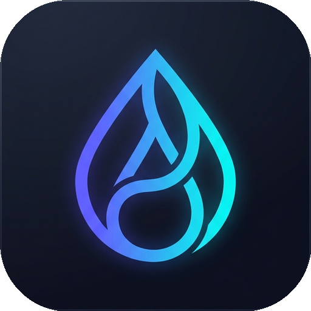
  
  # ADrop

  **Ultra-fast offline local file transfer for Windows - up to 150+ MB/s over WiFi.**

  [](https://github.com/BeginnerAman/ADrop/releases)
  [](https://github.com/BeginnerAman/ADrop)
  [](https://opensource.org/licenses/MIT)
  [](https://github.com/BeginnerAman/ADrop/stargazers)
  [](https://github.com/BeginnerAman/ADrop/releases)

  ### *Transfer files between your phone and PC - no internet, no cables, no apps to install.*
</div>

---

<div align="center">
  <table>
    <tr>
      <td align="center"><b>Desktop Dashboard</b></td>
      <td align="center"><b>Mobile UI</b></td>
    </tr>
    <tr>
      <td>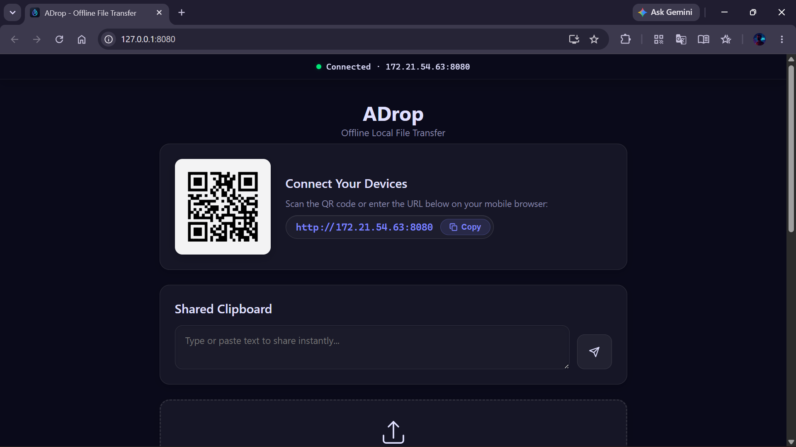</td>
      <td>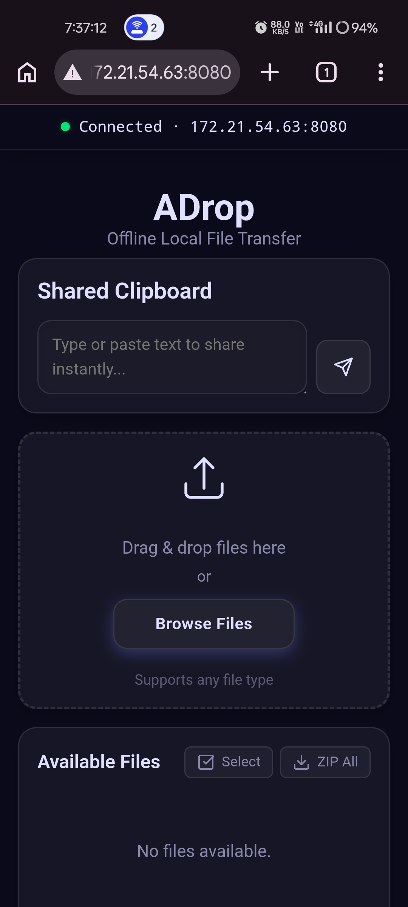</td>
    </tr>
  </table>
</div>

## Features

| Feature | Description |
| :--- | :--- |
| **Instant Local Transfer** | Transfer at up to 150+ MB/s over WiFi with zero throttling. No internet needed. Works over WiFi, Mobile Hotspot, or USB Tethering. |
| **QR Code Connection** | Just scan the QR code with your phone's camera. No app installation needed - works in any mobile browser. |
| **Smart Clipboard Sharing** | Share text instantly between devices. Auto-detects URLs, phone numbers, OTPs, and email addresses with one-tap Smart Action chips. |
| **Media Streaming & Preview** | Preview videos, images, audio, PDFs and documents directly in browser. Full video seeking support with HTTP Range Requests. |
| **Resumable Uploads** | Large file transfers resume automatically if interrupted. Never start from scratch. |
| **PIN Protection** | Optional PIN code security to restrict access. |
| **Batch ZIP Download** | Select multiple files or download all files as a single ZIP archive. |
| **RAM-Safe Streaming** | Constant memory usage regardless of file size. Processes files in 2-4 MB chunks - tested with multi-GB files. |
| **Installable PWA** | Install ADrop on your phone's home screen for instant access. Works offline with Service Worker caching. |
| **Zero-Copy Local Sharing** | Share files directly from any drive on your PC without copying. Files stream from their original location. |
| **Auto-Configuration** | Auto-detects network IP, creates Windows Firewall rules, opens browser automatically. Just double-click and go. |
| **Real-Time Sync** | WebSocket-powered instant sync. File list and clipboard update across all connected devices in real-time. |

## Download

| Option | Description | Link |
| :--- | :--- | :--- |
| **Installer (.exe)** | Automated setup. Installs ADrop on your PC. | [Download ADrop.exe](https://github.com/BeginnerAman/ADrop/releases/latest/download/ADrop.exe) |
| **Portable (.zip)** | No installation required. Just extract and run. | [Download ADrop-Portable.zip](https://github.com/BeginnerAman/ADrop/releases/latest/download/ADrop-Portable.zip) |

## Quick Start

1. **Download** - Get `ADrop.exe` (Installer) or `ADrop-Portable.zip` (Portable) from the [Releases](https://github.com/BeginnerAman/ADrop/releases).
2. **Run** - Double-click `ADrop.exe`. It auto-opens your browser and shows a QR code.
3. **Connect** - Scan the QR code with your phone. Start transferring files instantly!

## Screenshots

### Desktop Interface

<table>
  <tr>
    <td>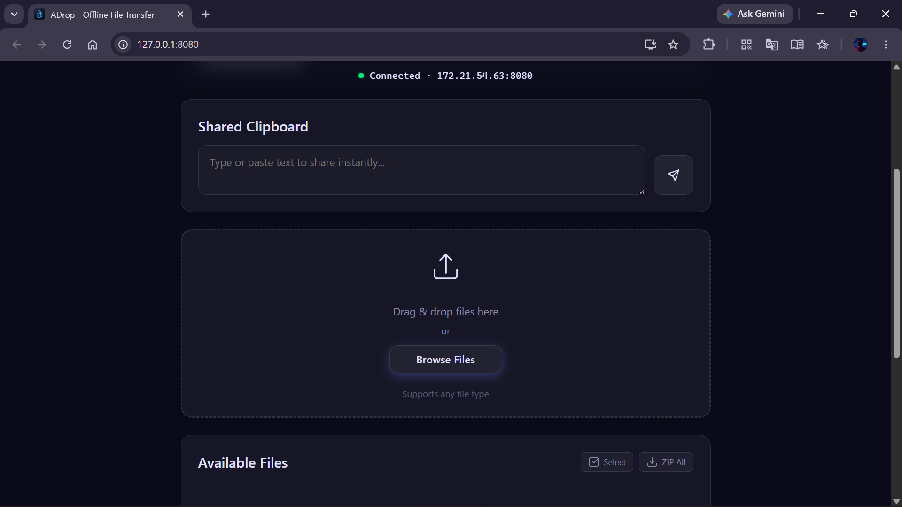<br><sup>Drag & Drop Upload Zone</sup></td>
    <td>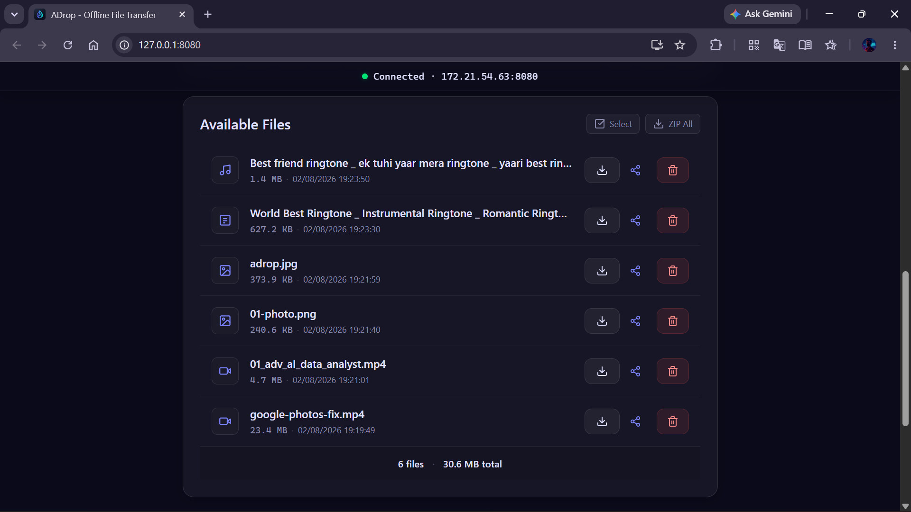<br><sup>File List & Controls</sup></td>
  </tr>
  <tr>
    <td>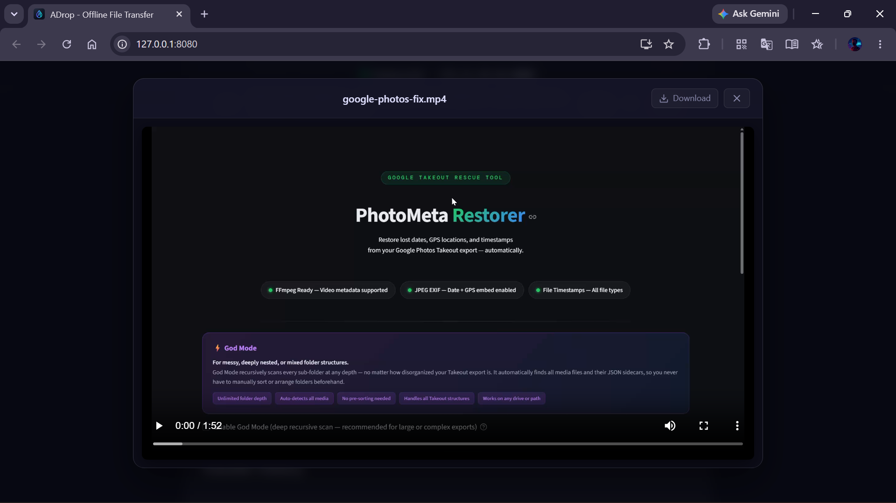<br><sup>Video Preview with Player</sup></td>
    <td>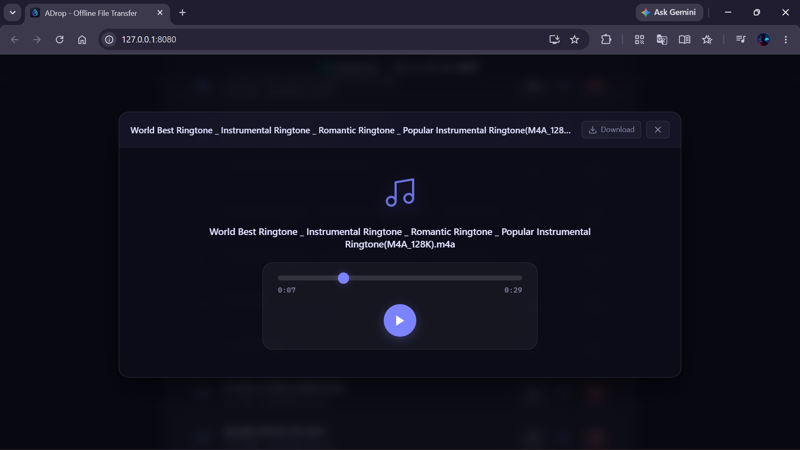<br><sup>Audio Preview</sup></td>
  </tr>
  <tr>
    <td>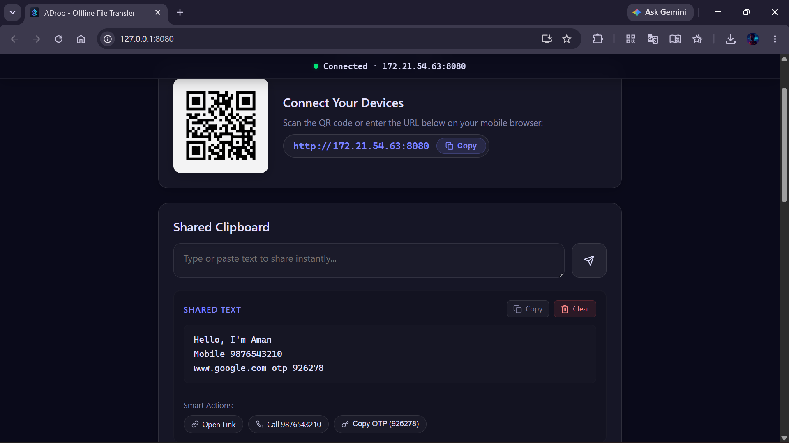<br><sup>Smart Clipboard with Actions</sup></td>
    <td>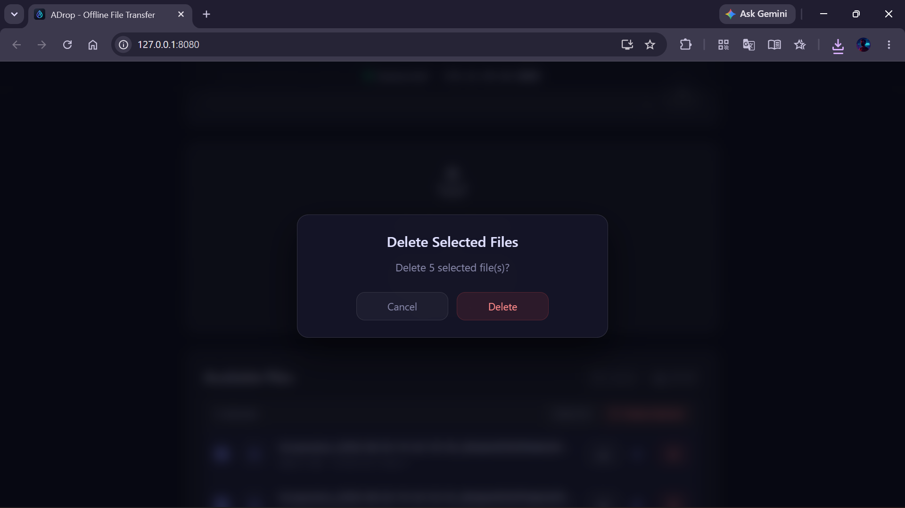<br><sup>Native File Browser</sup></td>
  </tr>
</table>

### Mobile Interface

<table width="100%">
  <tr>
    <td align="center" width="33%"><br><sup>Main Interface</sup></td>
    <td align="center" width="33%">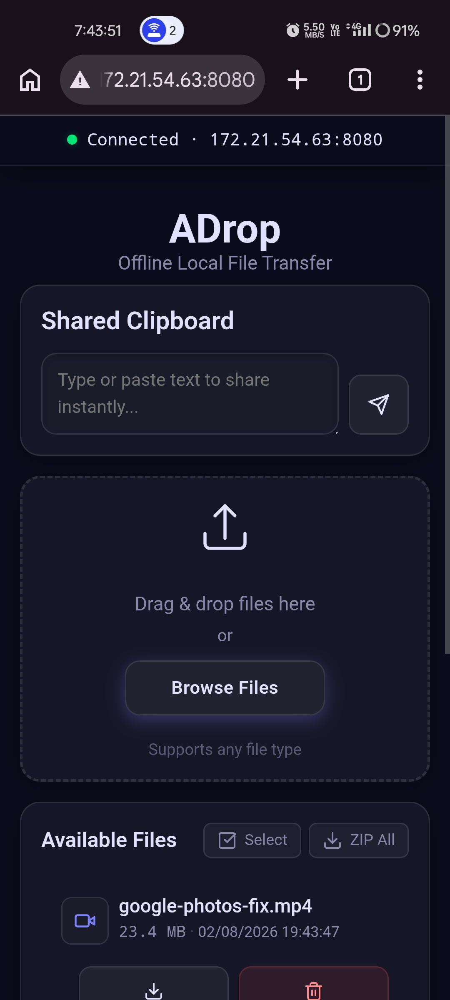<br><sup>File List</sup></td>
    <td align="center" width="33%">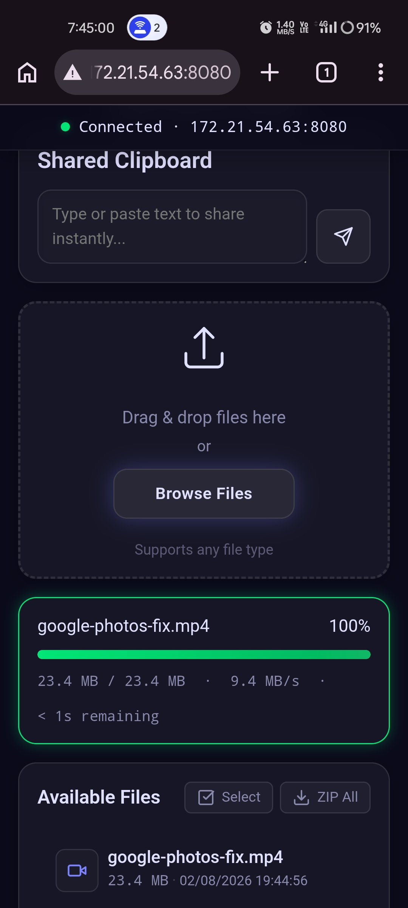<br><sup>Upload Complete</sup></td>
  </tr>
  <tr>
    <td align="center" width="33%">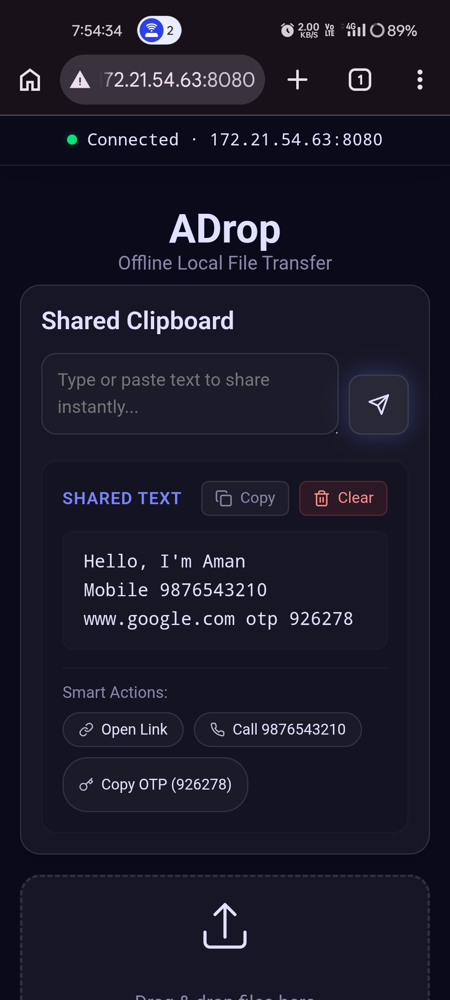<br><sup>Smart Clipboard</sup></td>
    <td align="center" width="33%">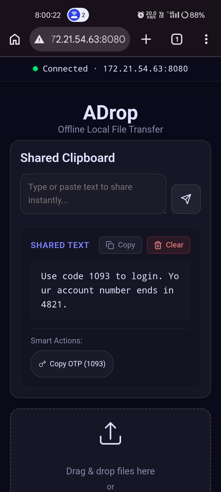<br><sup>OTP Auto-Detect</sup></td>
    <td align="center" width="33%">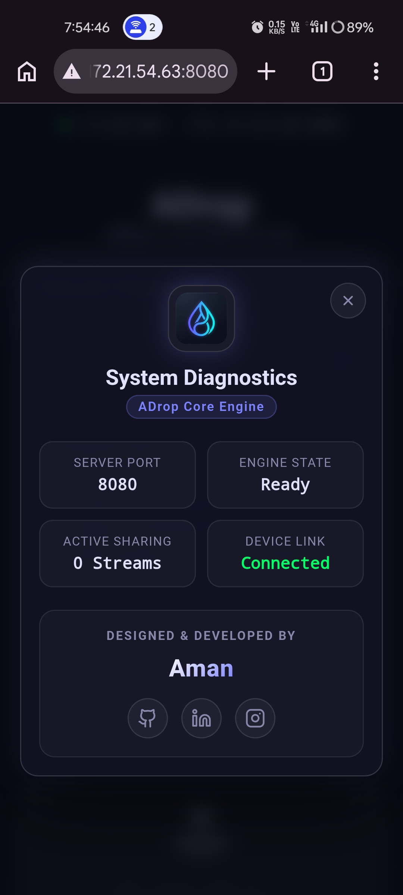<br><sup>System Diagnostics</sup></td>
  </tr>
</table>

## Tech Stack

* **Backend:**    Aiofiles
* **Frontend:**   
* **Transfer:** WebSockets, Web Workers, Service Workers (PWA)
* **Build:** PyInstaller (Standalone `.exe`)

## Architecture

```
+--------------------+        +--------------------+        +--------------------+
|                    |        |                    |        |                    |
|  Client Browser    | <====> |   FastAPI Server   | <====> |    File System     |
|  (Mobile/Desktop)  |   WS   |   (Uvicorn Host)   |        |  (PC Local Drive)  |
|                    |        |                    |        |                    |
+--------------------+        +--------------------+        +--------------------+
       |   |                           |                             |
       |   +--- HTTP Range Requests ---+                             |
       |                                                             |
       +--- Service Worker (PWA)                                     |
```

## License

This project is licensed under the [MIT License](LICENSE).

---

<div align="center">
  <b>Built with ❤️ by Aman Vishwakarma</b>
</div>
